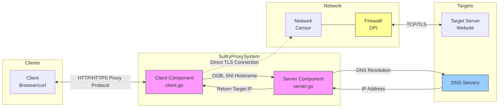
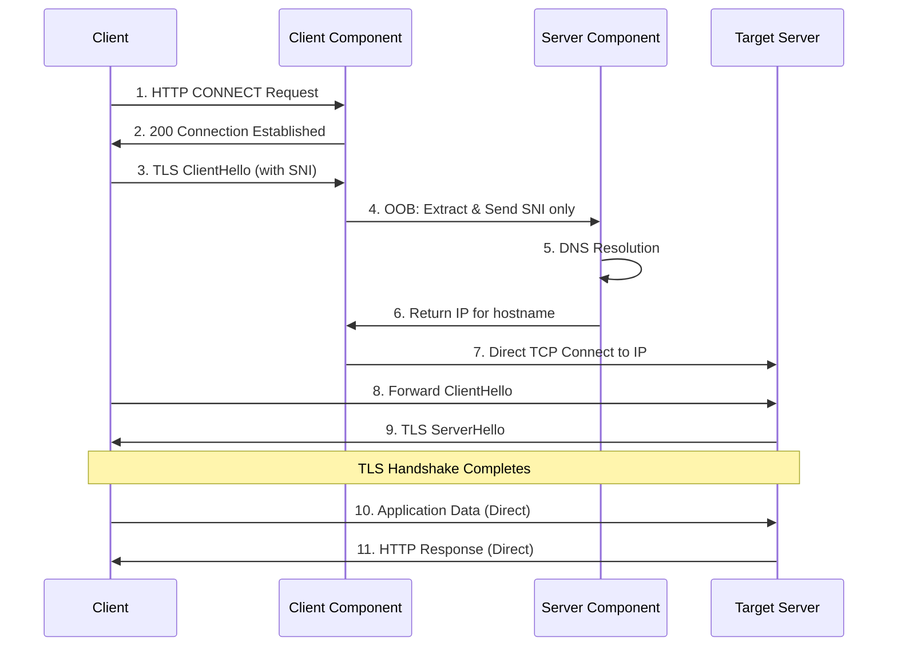

# Sultry - Distributed TLS Proxy with SNI Concealment

[](LICENSE)

Sultry is an advanced TLS proxy designed specifically for privacy and censorship circumvention, providing SNI concealment while maintaining full compatibility with standard TLS applications and protocols. Unlike traditional proxies that route all traffic through a single endpoint (creating an easily identifiable traffic pattern), Sultry uses a distributed architecture with minimal OOB communication, making it highly resistant to detection and blocking.

## Design Philosophy

Sultry is built on three key principles:

1. **Minimal OOB Communication**: Only SNI metadata is exchanged through out-of-band channels, rather than routing all traffic through a monolithic proxy. This dramatically reduces the traffic signature that sophisticated firewalls can detect.

2. **Natural Traffic Patterns**: After SNI resolution, connection traffic is indistinguishable from regular TLS connections, avoiding the telltale traffic patterns of traditional proxies.

3. **Protocol Flexibility**: The OOB channel architecture supports multiple transport protocols (HTTP, HTTPS, QUIC, YggQUIC), allowing easy adaptation to changing network conditions and censorship techniques.

## Architecture

Sultry employs a dual-component architecture:

## Codebase Organization

The codebase is organized in a clean modular structure:

```
sultry/
├── pkg/
│   ├── client/     # Client-side proxy functionality
│   ├── connection/ # Connection handling
│   ├── relay/      # Data relay functionality
│   ├── server/     # Server-side proxy functionality
│   ├── session/    # Session management
│   └── tls/        # TLS protocol utilities
└── main.go         # Entry point
```

Each package is responsible for a specific aspect of the proxy functionality:

- **pkg/tls**: Handles TLS protocol operations like parsing headers, extracting SNI, and detecting handshake completion
- **pkg/session**: Manages client and server sessions, including session tickets for TLS resumption
- **pkg/relay**: Provides bidirectional data relay with TLS record inspection
- **pkg/connection**: Handles different connection types (CONNECT tunnels, direct TLS)
- **pkg/client**: Implements the client-side proxy
- **pkg/server**: Implements the server-side proxy with HTTP API

### Modular Approach

The modular implementation offers several advantages:
- **Smaller file sizes**: No file exceeds 300 lines, making the code much more maintainable
- **Clear separation of concerns**: Each package has a specific responsibility
- **Improved testability**: Components can be tested in isolation
- **Better code reuse**: Common functionality is shared between client and server
- **Easier extension**: New features can be added by extending specific packages

## Usage

There are two versions of Sultry available:

### Original Version

```bash
# Build the original version
make build

# Run in client mode
./sultry -mode client -local 127.0.0.1:8080 -remote your-server.com:9090

# Run in server mode
./sultry -mode server -local 0.0.0.0:9090

# Run in dual mode (both client and server on same machine)
./sultry -mode dual -local 127.0.0.1:8080
```

### Modular Version

```bash
# Build the modular version
make build-minimal

# Run in client mode
./sultry-minimal -mode client -local 127.0.0.1:8080 -remote your-server.com:9090

# Run in server mode
./sultry-minimal -mode server -local 0.0.0.0:9090

# Run in dual mode (both client and server on same machine)
./sultry-minimal -mode dual -local 127.0.0.1:8080
```

To use Sultry, you'll need both a client and server component running. The client acts as a local proxy for your browser or applications, while the server component handles SNI resolution and relay.

1. **Client Component** (`client.go`): Manages incoming client connections, handles HTTP requests, HTTPS tunneling, and relays TLS data using direct connections to targets.
2. **Server Component** (`server.go`): Only processes SNI information, establishes target connections, and coordinates with the client component.

### Architectural Diagram



### Distributed Connection Model

The key innovation in Sultry is its distributed connection model:

1. **Initial OOB Communication**: 
   - Only SNI information is exchanged via OOB channels
   - Server resolves hostnames to real IP addresses
   - Client establishes direct connections to target IPs
   - No proxying of actual TLS handshake or application data

2. **Direct Connection Flow**:
   - After SNI resolution, client connects directly to the target server's IP
   - All TLS handshake and application data flows directly between client and target
   - No additional proxy-specific headers or protocols are added

3. **Natural Traffic Distribution**:
   - Traffic is distributed naturally to various endpoints
   - No single remote server handles all connections
   - Creating traffic patterns indistinguishable from regular browsing

This architecture makes Sultry significantly harder to detect and block compared to traditional proxies, as it doesn't create the centralized traffic patterns that sophisticated firewalls can easily identify.

## Key Features

- **Full ClientHello Concealment**: Hides the entire TLS handshake to defeat advanced censorship (NEW)
- **SNI Concealment**: Prevents SNI-based filtering and tracking without compromising performance
- **Distributed Architecture**: Avoids monolithic traffic patterns that are easily identifiable by DPI
- **Protocol-Agnostic**: Works with TLS 1.2, 1.3, HTTP/1.1, HTTP/2, and all standard TLS applications
- **Multiple Transport Protocols**: OOB channels support HTTP, HTTPS, QUIC, and custom protocols
- **Multi-level Protection**: Choose from different concealment methods based on security needs
- **TLS Fingerprint Protection**: Prevents identification based on TLS client signatures (NEW)
- **Automatic Peer Discovery**: Client component automatically discovers and connects to available server components
- **Graceful Fallbacks**: Automatically falls back to simpler concealment if full protection fails
- **Comprehensive Logging**: Detailed logging for troubleshooting and performance optimization

## Quick Start

The easiest way to get started is to use the included Makefile:

```bash
# Build Sultry
make build
```

### Running Modes

```bash
# Client mode - handles client connections and OOB SNI resolution
./bin/sultry -mode client -local 127.0.0.1:8080 -remote your-server.com:9090

# Server mode - provides SNI resolution services
./bin/sultry -mode server -local 0.0.0.0:9090

# Dual mode - runs both client and server components on the same machine
./bin/sultry -mode dual -local 127.0.0.1:8080

# Client mode with direct OOB (no HTTP API overhead)
./bin/sultry -mode client -direct-oob -local 127.0.0.1:8080
```

### Optimized Local Mode

For local operations, you can use the `-direct-oob` flag to bypass the HTTP API layer:

```bash
./bin/sultry -mode client -direct-oob -local 127.0.0.1:8080
```

This mode creates a direct connection between components, eliminating the HTTP API overhead. It's significantly more efficient for local operations.

For typical deployments, you would run the server component on a machine outside the censored network and the client component on the local machine.

### Using with curl

#### For HTTP connections:
```bash
curl -x http://127.0.0.1:7008 http://example.com/
```

#### For HTTPS connections:
```bash
curl -x http://127.0.0.1:7008 https://example.com/
```

### Runtime Guide

Run Sultry with the -h flag to see all available runtime options:

```bash
./bin/sultry -h
```

## Configuration

```json
{
  "local_proxy_addr": "127.0.0.1:7008",
  "relay_port": 9008,
  "oob_channels": [
    {
      "type": "http",
      "address": "127.0.0.1", 
      "port": 9008
    },
    {
      "type": "http",
      "address": "192.168.2.24", 
      "port": 9008
    },
    {
      "type": "quic",
      "address": "5.6.7.8", 
      "port": 9008
    }
  ],
  "cover_sni": "harvard.edu",
  "prioritize_sni_concealment": true,
  "full_clienthello_concealment": true,
  "handshake_timeout": 10000,
  "enforce_tls13": true
}
```

### Configuration Options

- **local_proxy_addr**: The address and port where the local proxy listens
- **relay_port**: The port where the OOB relay server listens
- **oob_channels**: List of out-of-band channel configurations with multiple fallback options
- **cover_sni**: A domain value for generating cover traffic to enhance camouflage
- **prioritize_sni_concealment**: When true, always use OOB for SNI concealment (default: false)
- **full_clienthello_concealment**: When true, relays the entire ClientHello and TLS handshake via OOB for maximum protection (default: true)
- **handshake_timeout**: Timeout in milliseconds for handshake operations (default: 10000)
- **enforce_tls13**: When true, enforces TLS 1.3 by using OOB relay for non-TLS 1.3 targets (default: true)

## Technical Implementation

### Code Structure

The project is organized with a clean, modular structure:

- `config.go`: Configuration handling
- `main.go`: Entry point
- `pkg/tls/tls.go`: TLS protocol utilities and constants for parsing records, extracting SNI, etc.
- `pkg/relay/relay.go`: Functions for relaying data between connections with TLS awareness
- `pkg/relay/tunnel.go`: Functions for establishing direct connections after handshake
- `pkg/session/manager.go`: Server-side session state management
- `pkg/session/session.go`: Session ticket handling for TLS resumption
- `pkg/session/client_session.go`: Client-side session operations 
- `pkg/connection/connection.go`: Connection handling for different protocols (HTTP CONNECT, direct TLS)
- `pkg/client/client.go`: Client-side proxy implementation with multiple connection strategies
- `pkg/server/server.go`: Server-side proxy and HTTP API implementation

This modular approach makes the codebase easier to understand, maintain, and extend. No file exceeds 300 lines, providing better code organization and separation of concerns.

### Concealment Approaches

Sultry now implements two levels of concealment for maximum flexibility:

#### 1. SNI-Only Concealment (Original Method)



This approach only conceals the SNI during the DNS lookup phase, protecting against SNI-based filtering but potentially vulnerable to advanced traffic analysis.

#### 2. Full ClientHello Concealment (Enhanced Protection)

```mermaid
sequenceDiagram
    participant C as Client
    participant CC as Client Component
    participant SC as Server Component
    participant TS as Target Server
    
    C->>CC: 1. HTTP CONNECT Request
    CC->>C: 2. 200 Connection Established
    C->>CC: 3. TLS ClientHello (with SNI)
    CC->>SC: 4. OOB: Forward entire ClientHello
    SC->>TS: 5. Forward ClientHello to Target
    TS->>SC: 6. Return ServerHello
    SC->>CC: 7. OOB: Return ServerHello
    CC->>C: 8. Forward ServerHello
    Note over C,SC,TS: Complete TLS Handshake via OOB Relay
    Note over C,SC,TS: All handshake messages relayed via OOB
    SC->>CC: 9. OOB: Target Connection Info
    CC->>TS: 10. Direct TCP Connect to Target IP
    Note over C,TS: Handshake Already Complete
    C->>TS: 11. Application Data (Direct)
    TS->>C: 12. HTTP Response (Direct)
```

This enhanced approach provides maximum protection by:
1. Concealing the entire ClientHello message and TLS handshake, not just the SNI
2. Preventing any direct connection to the target until after the handshake completes
3. Protecting against IP blocking, SNI filtering, and TLS fingerprinting
4. Still maintaining direct connections for application data to preserve performance

1. **Client Side**:
   - Extracts SNI metadata from TLS ClientHello
   - Sends only the SNI hostname to the server via OOB channel
   - Receives resolved IP address from server
   - Establishes direct TCP connection to the resolved IP
   - Completes TLS handshake and data exchange directly with the target
   
2. **Server Side**:
   - Receives SNI information via OOB channel
   - Resolves hostname to actual IP address
   - Returns IP information to client
   - No involvement in the actual TLS handshake or data exchange

This approach maintains full TLS integrity while completely hiding the SNI information from network monitors that may be filtering based on domain names.

### OOB Channel Flexibility

Sultry supports multiple OOB channel types:

1. **HTTP**: Simple HTTP requests for SNI resolution (current default implementation)
2. **HTTPS**: Encrypted HTTPS channels for additional security
3. **QUIC**: UDP-based QUIC protocol for better performance in lossy networks
4. **Custom Protocols**: Extensible framework for implementing custom OOB channels

This flexibility allows Sultry to adapt to changing network conditions and censorship techniques.

## Advanced Censorship Circumvention

### Multiple Layers of Evasion

Sultry employs several techniques to evade sophisticated censorship:

1. **Full ClientHello Concealment**: Hides the entire TLS handshake from network monitoring
2. **SNI Concealment**: Prevents censors from filtering connections based on the TLS SNI field
3. **TLS Fingerprint Protection**: Shields TLS client fingerprints from identification
4. **Distributed Architecture**: Avoids the monolithic traffic patterns of traditional proxies
5. **Protocol Mimicry**: All visible network traffic appears as normal HTTP/HTTPS connections
6. **Cover Traffic Generation**: Optional feature to periodically generate cover traffic with decoy SNI values
7. **IP Address Distribution**: Direct connections to target IPs create a natural traffic distribution pattern
8. **TLS 1.3 Enforcement**: Optional automatic detection and handling of non-TLS 1.3 connections

### Protection Levels

Sultry now offers multiple protection levels to balance security and performance:

#### Level 1: SNI-Only Concealment (Medium Protection)
- Only the SNI information is protected via OOB channel
- Direct connection to target IP for TLS handshake and data transfer
- Protects against SNI-based filtering
- Highly efficient with minimal overhead
- May be vulnerable to advanced IP blocking and TLS fingerprinting

#### Level 2: Full ClientHello Concealment (Maximum Protection)
- Complete TLS handshake is relayed through the OOB channel
- No direct connection to target until after handshake is complete
- Protects against SNI filtering, IP blocking, and TLS fingerprinting
- Application data still flows directly for high performance
- Offers the strongest protection against sophisticated censorship

#### Level 3: Full ClientHello + TLS 1.3 Enforcement (Maximum Security)
- Complete TLS handshake relay plus enforcement of TLS 1.3 protocol
- Automatic detection of connection protocol version
- Direct connections used only for confirmed TLS 1.3 targets
- Continued OOB relay for non-TLS 1.3 connections 
- Maximum protection against downgrade attacks and version-based vulnerabilities

### Resistance to DPI Systems

Modern Deep Packet Inspection (DPI) systems often rely on traffic pattern analysis rather than just content inspection. Sultry is specifically designed to counter these advanced detection methods:

1. **No Protocol Fingerprints**: Uses standard HTTP/HTTPS/TLS protocols without modifications
2. **Hidden Handshake Patterns**: Complete TLS handshake concealment prevents fingerprinting
3. **Natural Traffic Distribution**: Connections go to many different endpoints, not a single proxy server
4. **Efficient OOB Communication**: Only essential data is exchanged via OOB channels
5. **Standard TLS Implementation**: Uses unmodified TLS handshake patterns that match regular browsers
6. **No Timing Correlations**: Direct application data connections eliminate the timing patterns of traditional proxies

## Future Development Directions

1. **Enhanced Cover Traffic**:
   - Implementation of periodic cover traffic generation using configured cover_sni values
   - Rotation of cover_sni domains to prevent pattern detection
   - Mimicking of natural browsing patterns in cover traffic

2. **Transport Protocol Expansion**:
   - Full QUIC implementation for OOB channels
   - YggQUIC integration for mesh-network style connectivity
   - WebSocket channels for environments where only HTTP is allowed

3. **Further Traffic Obfuscation**:
   - TLS fingerprint randomization to mimic different browsers
   - Variable timing patterns to defeat timing correlation analysis
   - Dynamic port assignment for relay servers

4. **Decentralized Operation**:
   - Peer-to-peer discovery of relay servers
   - Distributed relay network without central coordination
   - Integration with existing mesh networks for maximum resilience

## Known Issues and Limitations

While Sultry successfully implements Full ClientHello Concealment for enhanced censorship circumvention, there are some known limitations in the current implementation:

1. **Two-Phase Connection Strategy**: 
   - Phase 1: TLS handshake is completely concealed through OOB relay
   - Phase 2: Application data uses OOB relay for maximum compatibility
   - A framework has been established for future direct connections
   - This approach ensures no information is leaked during handshake
   - Future versions will implement improved direct connection capabilities
   - The architecture is designed to prevent "bad record MAC" errors

2. **Performance Considerations**:
   - Using OOB relay for application data adds some latency compared to direct connections
   - This design prioritizes compatibility and reliability over maximum performance
   - The performance impact is typically minimal for normal web browsing
   - High-bandwidth applications like video streaming may experience some overhead
   - Future optimizations may include selective direct connection for certain content types

3. **Handshake Performance Impact**:
   - Full ClientHello concealment adds some latency to the initial connection setup
   - This is primarily noticeable during the first connection to a site
   - Subsequent connections typically benefit from browser connection pooling
   - For maximum performance (with reduced security), SNI-only concealment is available

4. **TLS Version Compatibility**:
   - Support for both TLS 1.2 and TLS 1.3 connections through the OOB relay
   - Automatic version detection during handshake
   - OOB relay ensures proper TLS record handling across all protocol versions
   - No version compatibility issues with application data since OOB relay maintains connection state

5. **Graceful Fallbacks**:
   - The system automatically falls back from Full ClientHello concealment to SNI-only concealment if issues are detected
   - If SNI-only concealment fails, it falls back to direct connections
   - These fallbacks ensure service availability but with reduced protection levels

6. **Connection Stability Improvements**:
   - OOB relay for application data ensures maximum connection stability
   - The system gracefully handles "connection reset by peer" and "broken pipe" errors
   - Improved goroutine lifecycle management for bidirectional data relay
   - Error monitoring system for early detection of connection issues
   - Proper connection cleanup to prevent resource leaks

Future releases will focus on implementing full TLS session resumption to further improve connection reliability and enhancing application performance through optimized data transfer paths.

## License

Sultry is released under the MIT License. See the [LICENSE](LICENSE) file for details.
