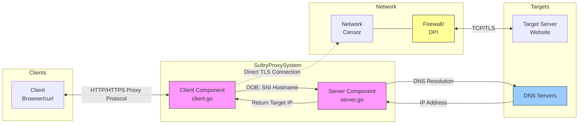
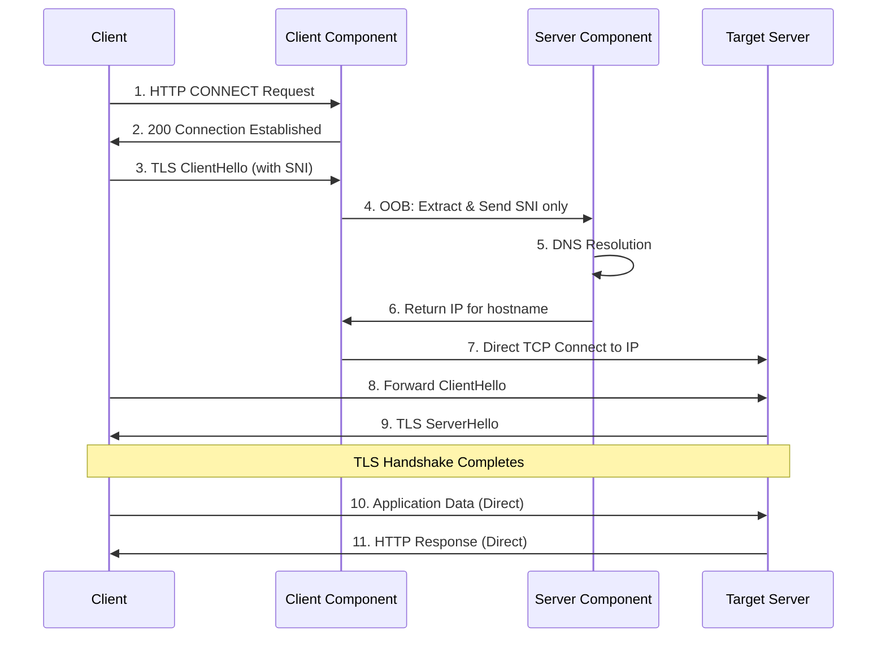

# Sultry - Distributed TLS Proxy with SNI Concealment

[](LICENSE)

Sultry is an advanced TLS proxy designed specifically for privacy and censorship circumvention, providing SNI concealment while maintaining full compatibility with standard TLS applications and protocols. Unlike traditional proxies that route all traffic through a single endpoint (creating an easily identifiable traffic pattern), Sultry uses a distributed architecture with minimal OOB communication, making it highly resistant to detection and blocking.

## Design Philosophy

Sultry is built on three key principles:

1. **Minimal OOB Communication**: Only SNI metadata is exchanged through out-of-band channels, rather than routing all traffic through a monolithic proxy. This dramatically reduces the traffic signature that sophisticated firewalls can detect.

2. **Natural Traffic Patterns**: After SNI resolution, connection traffic is indistinguishable from regular TLS connections, avoiding the telltale traffic patterns of traditional proxies.

3. **Protocol Flexibility**: The OOB channel architecture supports multiple transport protocols (HTTP, HTTPS, QUIC, YggQUIC), allowing easy adaptation to changing network conditions and censorship techniques.

## Architecture

Sultry employs a dual-component architecture:

1. **Client Component** (`client.go`): Manages incoming client connections, handles HTTP requests, HTTPS tunneling, and relays TLS data using direct connections to targets.
2. **Server Component** (`server.go`): Only processes SNI information, establishes target connections, and coordinates with the client component.

### Architectural Diagram



### Distributed Connection Model

The key innovation in Sultry is its distributed connection model:

1. **Initial OOB Communication**: 
   - Only SNI information is exchanged via OOB channels
   - Server resolves hostnames to real IP addresses
   - Client establishes direct connections to target IPs
   - No proxying of actual TLS handshake or application data

2. **Direct Connection Flow**:
   - After SNI resolution, client connects directly to the target server's IP
   - All TLS handshake and application data flows directly between client and target
   - No additional proxy-specific headers or protocols are added

3. **Natural Traffic Distribution**:
   - Traffic is distributed naturally to various endpoints
   - No single remote server handles all connections
   - Creating traffic patterns indistinguishable from regular browsing

This architecture makes Sultry significantly harder to detect and block compared to traditional proxies, as it doesn't create the centralized traffic patterns that sophisticated firewalls can easily identify.

## Key Features

- **SNI Concealment**: Prevents SNI-based filtering and tracking without compromising performance
- **Distributed Architecture**: Avoids monolithic traffic patterns that are easily identifiable by DPI
- **Protocol-Agnostic**: Works with TLS 1.2, 1.3, HTTP/1.1, HTTP/2, and all standard TLS applications
- **Multiple Transport Protocols**: OOB channels support HTTP, HTTPS, QUIC, and custom protocols
- **Automatic Peer Discovery**: Client component automatically discovers and connects to available server components
- **Graceful Fallbacks**: Automatically falls back to direct connections if SNI concealment fails
- **Comprehensive Logging**: Detailed logging for troubleshooting and performance optimization

## Usage

1. Configure in config.json
2. Build with `go build` or run directly with `go run .`
3. Run in one of three modes:

### Running Modes

```bash
# Client mode (default) - handles client connections and OOB SNI resolution
./sultry --mode client

# Server mode - provides SNI resolution services
./sultry --mode server

# Dual mode - runs both client and server components on the same machine
./sultry --mode dual
```

For typical deployments, you would run the server component on a machine outside the censored network and the client component on the local machine.

### Using with curl

#### For HTTP connections:
```bash
curl -x http://127.0.0.1:7008 http://example.com/
```

#### For HTTPS connections:
```bash
curl -x http://127.0.0.1:7008 https://example.com/
```

## Configuration

```json
{
  "local_proxy_addr": "127.0.0.1:7008",
  "relay_port": 9008,
  "oob_channels": [
    {
      "type": "http",
      "address": "127.0.0.1", 
      "port": 9008
    },
    {
      "type": "http",
      "address": "192.168.2.24", 
      "port": 9008
    },
    {
      "type": "quic",
      "address": "5.6.7.8", 
      "port": 9008
    }
  ],
  "cover_sni": "harvard.edu",
  "prioritize_sni_concealment": true,
  "handshake_timeout": 10000
}
```

### Configuration Options

- **local_proxy_addr**: The address and port where the local proxy listens
- **relay_port**: The port where the OOB relay server listens
- **oob_channels**: List of out-of-band channel configurations with multiple fallback options
- **cover_sni**: A domain value for generating cover traffic to enhance camouflage
- **prioritize_sni_concealment**: When true, always use OOB for SNI concealment (default: false)
- **handshake_timeout**: Timeout in milliseconds for handshake operations (default: 5000)

## Technical Implementation

### SNI Concealment Process



1. **Client Side**:
   - Extracts SNI metadata from TLS ClientHello
   - Sends only the SNI hostname to the server via OOB channel
   - Receives resolved IP address from server
   - Establishes direct TCP connection to the resolved IP
   - Completes TLS handshake and data exchange directly with the target
   
2. **Server Side**:
   - Receives SNI information via OOB channel
   - Resolves hostname to actual IP address
   - Returns IP information to client
   - No involvement in the actual TLS handshake or data exchange

This approach maintains full TLS integrity while completely hiding the SNI information from network monitors that may be filtering based on domain names.

### OOB Channel Flexibility

Sultry supports multiple OOB channel types:

1. **HTTP**: Simple HTTP requests for SNI resolution (current default implementation)
2. **HTTPS**: Encrypted HTTPS channels for additional security
3. **QUIC**: UDP-based QUIC protocol for better performance in lossy networks
4. **Custom Protocols**: Extensible framework for implementing custom OOB channels

This flexibility allows Sultry to adapt to changing network conditions and censorship techniques.

## Advanced Censorship Circumvention

### Multiple Layers of Evasion

Sultry employs several techniques to evade sophisticated censorship:

1. **SNI Concealment**: Prevents censors from filtering connections based on the TLS SNI field
2. **Distributed Architecture**: Avoids the monolithic traffic patterns of traditional proxies
3. **Protocol Mimicry**: All visible network traffic appears as normal HTTP/HTTPS connections
4. **Cover Traffic Generation**: Optional feature to periodically generate cover traffic with decoy SNI values
5. **IP Address Distribution**: Direct connections to target IPs create a natural traffic distribution pattern

### Resistance to DPI Systems

Modern Deep Packet Inspection (DPI) systems often rely on traffic pattern analysis rather than just content inspection. Sultry is specifically designed to counter these advanced detection methods:

1. **No Protocol Fingerprints**: Uses standard HTTP/HTTPS/TLS protocols without modifications
2. **Natural Traffic Distribution**: Connections go to many different endpoints, not a single proxy server
3. **Minimal OOB Communication**: Only lightweight metadata is exchanged via OOB channels
4. **Standard TLS Implementation**: Uses unmodified TLS handshake patterns that match regular browsers
5. **No Timing Correlations**: Direct connections eliminate the timing patterns of traditional proxies

## Future Development Directions

1. **Enhanced Cover Traffic**:
   - Implementation of periodic cover traffic generation using configured cover_sni values
   - Rotation of cover_sni domains to prevent pattern detection
   - Mimicking of natural browsing patterns in cover traffic

2. **Transport Protocol Expansion**:
   - Full QUIC implementation for OOB channels
   - YggQUIC integration for mesh-network style connectivity
   - WebSocket channels for environments where only HTTP is allowed

3. **Further Traffic Obfuscation**:
   - TLS fingerprint randomization to mimic different browsers
   - Variable timing patterns to defeat timing correlation analysis
   - Dynamic port assignment for relay servers

4. **Decentralized Operation**:
   - Peer-to-peer discovery of relay servers
   - Distributed relay network without central coordination
   - Integration with existing mesh networks for maximum resilience

## License

Sultry is released under the MIT License. See the [LICENSE](LICENSE) file for details.
